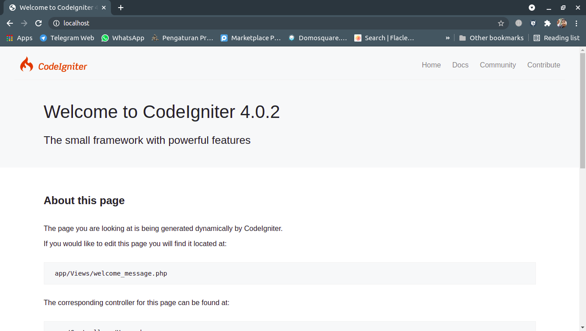
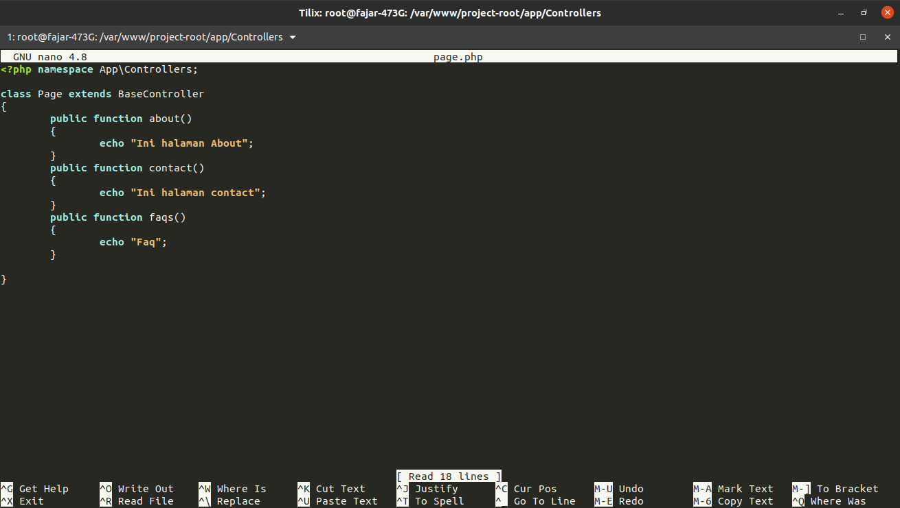
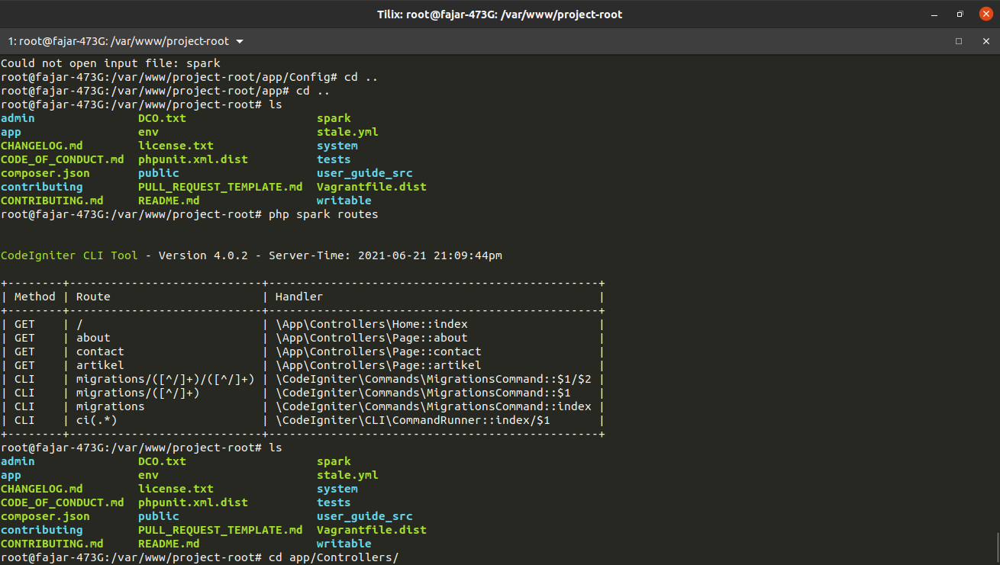
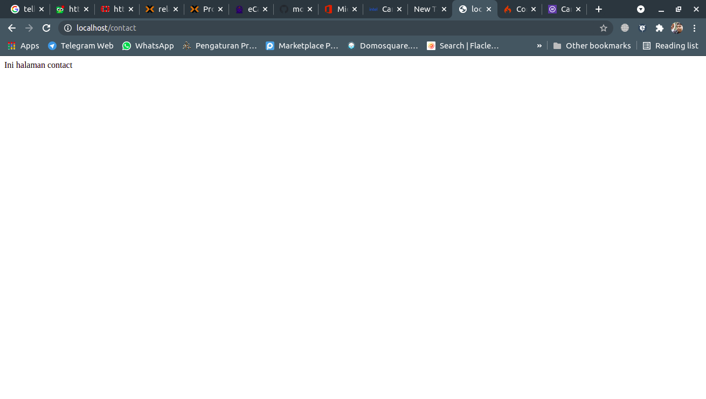
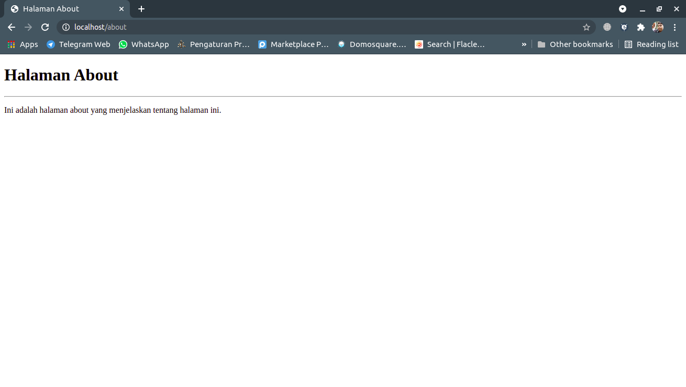
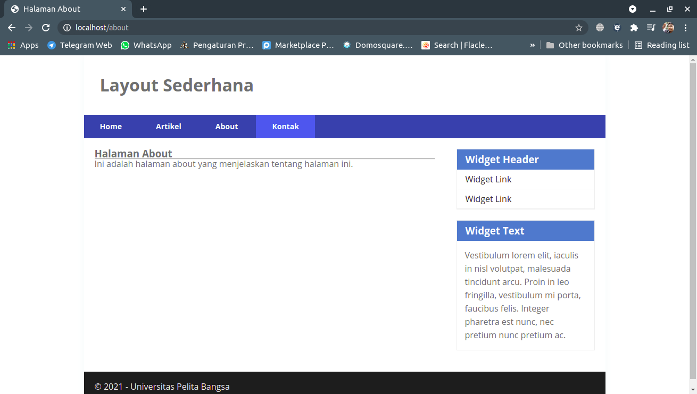
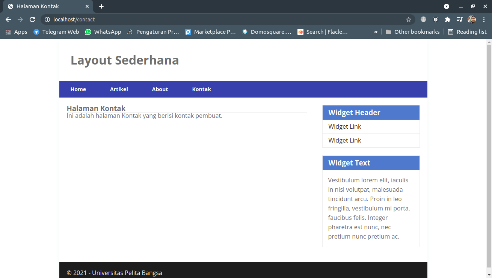

Fajar Arif Riyanto  
311910666  
TI 19 B2

1. Menyiapkan Web Server dan install Code Ignterc4.     
     

2. Membuat Controller dan test penggunaan controller.  
    

3. Memastikan route sudah benar.    
    

4. Test Controller yang telah di buat.  
     

5. Membuat page about.php.  
      
    <!--  -->

6. Memuat layout header dan footer.  
      
    <!--   -->

Tugas Pertemuan 11

Lengkapi kode program untuk menu lainnya yang ada pada Controller Page, sehingga semua link pada navigasi header dapat menampilkan tampilan dengan layout yang sama.

Membuat controller untuk page artikel dan kontak.  
      
    

